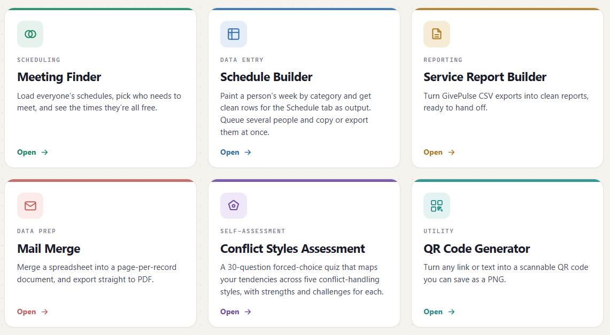

# SCSJ App Suite

A small set of self-contained, single-file browser tools built for running service-learning programs at Creighton University's Schlegel Center for Service & Justice. Everything runs entirely client-side. No server, and no data ever leaves the browser.

Open [index.html](index.html) at [jamesbrainard.github.io/scsj-app-suite](jamesbrainard.github.io/scsj-app-suite) for a landing page linking to all the tools, or open any tool directly.

## Tools

- **[Meeting Finder](meeting-finder.html):** Load everyone's schedules, pick who needs to meet, and see the times they're all free.
- **[Schedule Builder](schedule-builder.html):** Paint a person's week by category and get clean rows for the Schedule tab as output. Queue several people and copy or export them at once.
- **[Service Report Builder](service-report-builder.html):** Turn GivePulse CSV exports into clean, ready-to-hand-off reports.
- **[Mail Merge](mail-merge.html):** Merge a spreadsheet into a page-per-record document, and export straight to PDF.
- **[Conflict Styles Assessment](conflict-styles-assessment.html):** A 30-question forced-choice quiz mapping tendencies across five conflict-handling styles, with strengths and challenges for each.
- **[QR Code Generator](qr-code-generator.html):** Turn any link or text into a scannable QR code you can save as a PNG.

## Usage

Each tool is a standalone HTML file. Open it directly in a browser (double-click, or serve the folder with any static file server) — no installation or dependencies required.

## Adding a new tool

Add an entry to the `APPS` array in [index.html](index.html) (title, category, description, href, accent color, icon) and drop the new tool's HTML file alongside the others. The landing page grid and tool count update automatically.

## License

See [LICENSE](LICENSE).